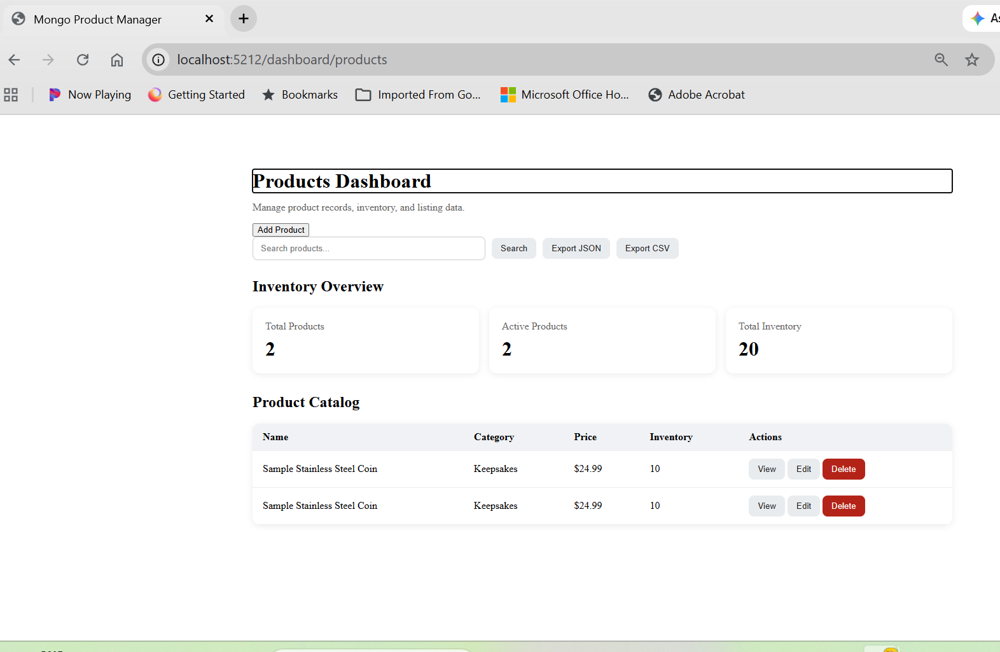
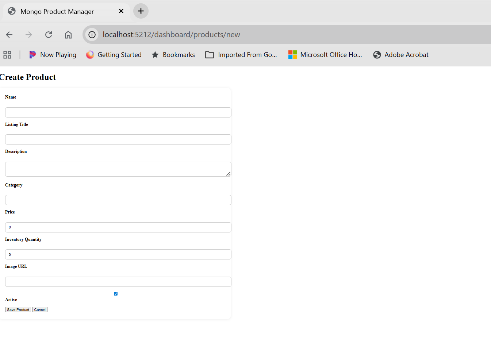
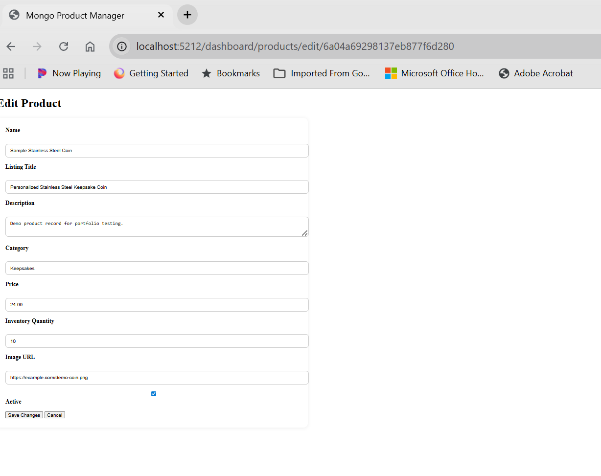
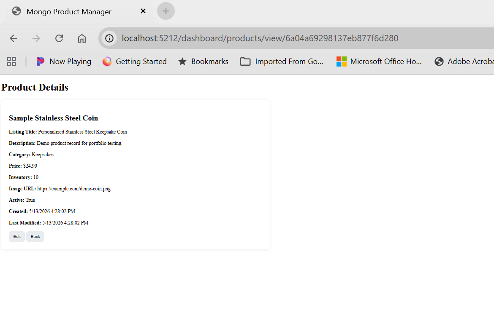

# Product Operations Manager

A Blazor + ASP.NET Core product operations dashboard for managing product records, inventory, search, analytics, and export workflows.

The current database implementation uses MongoDB, but the application is structured behind a repository interface so another database provider can be added later without rewriting the UI or controller layer.

Product Operations Manager was built to streamline product catalog management, inventory tracking, and export workflows through a single dashboard interface.

## Demo


- [Full walkthrough video](https://github.com/YourUserName/ProductOperationsManager/releases/download/v0.1.0/demo.mp4)

## Features

- Product CRUD
- Search and filtering
- Dashboard metrics
- CSV export
- JSON export
- MongoDB persistence
- Product detail views
- Repository-based data access
- Configurable database provider architecture

## Screenshots

### Dashboard



### Create Product



### Edit Product



### Product Details



---

## Overview

Product Operations Manager is a portfolio-ready internal business tool designed to demonstrate practical full-stack development through a real-world product management workflow.

This application provides:

- Product CRUD (Create / Read / Update / Delete)
- Product search and filtering
- Inventory and category statistics
- Product detail views
- JSON / CSV export
- Blazor dashboard UI
- Configurable database provider pattern
- MongoDB persistence as the first provider

---
## Quick Start

### Requirements
- .NET SDK
- MongoDB
- Visual Studio or VS Code

### Run the application

```bash
dotnet restore
dotnet build
dotnet run
```

---

### Run the seed script

```powershell
powershell -ExecutionPolicy Bypass -File .\scripts\seed-sample-products.ps1
```

### Expected Result

After running the script:

1. Launch the application
2. Open the dashboard
3. Sample records should appear automatically

### Product Dashboard
- View all products
- Search products by keyword
- Review inventory overview
- Monitor category metrics
- Export product data

### Product Management
- Add new products
- Edit existing products
- View full product details

### Analytics
- Total products
- Active vs inactive products
- Inventory totals
- Category counts
- Average pricing

### Export
- Export all products to JSON
- Export all products to CSV

---
## Database Seeding

This project includes a PowerShell seed script that inserts sample product data into MongoDB through the API.

### Requirements

- MongoDB running locally
- ASP.NET application running
- PowerShell 5+ or PowerShell Core

### Run the Application

From the project directory:

```bash
cd src/ProductOperationsManager
dotnet restore
dotnet run
```

Default API URL:

```txt
http://localhost:5212
```

### Run the Seed Script

From the repository root:

```powershell
.\scripts\seed-sample-products.ps1
```

### What the Script Does

The seed script:

- Creates sample product records
- Sends data to the Products API
- Populates MongoDB with demo data for testing and screenshots

### Notes

If needed, update the API URL inside:

```txt
scripts/seed-sample-products.ps1
```

to match your local environment.

---

## Demo Workflow

1. Launch the Blazor application
2. View the product dashboard
3. Search/filter products
4. Open a product details page
5. Edit a product
6. Save changes to MongoDB
7. Create a new product
8. Export or review updated data

### Demo Goal
Show a complete CRUD workflow in under 60 seconds.

---


## Documentation

Additional documentation is available in the `docs/` folder.

- `docs/architecture.md` — application structure and data flow

---

## Tech Stack

### Frontend
- Blazor Server
- Razor Pages
- HTML / CSS

### Backend
- ASP.NET Core
- C#
- RESTful API Controllers
- Repository pattern for database access

### Database
- MongoDB current provider
- Provider abstraction prepared for future database implementations

---

## Project Structure

```txt
ProductOperationsManager/
├── README.md
├── LICENSE
├── appsettings.example.json
├── assets/
│   └── screenshots/
└── src/
    └── ProductOperationsManager/
        ├── Controllers/
        ├── Data/
        ├── Options/
        ├── Repositories/
        ├── Shared/
        ├── wwwroot/
        ├── Program.cs
        └── ProductOperationsManager.csproj
```

---

## Configuration

Copy the example settings file and create your local settings file:

```bash
cp src/ProductOperationsManager/appsettings.example.json src/ProductOperationsManager/appsettings.json
```

Example:

```json
{
  "App": {
    "BaseUrl": "http://localhost:5212/"
  },
  "Database": {
    "Provider": "MongoDb"
  },
  "MongoDb": {
    "ConnectionString": "mongodb://localhost:27017",
    "DatabaseName": "ProductOperationsDemo",
    "ProductsCollection": "products"
  }
}
```

`appsettings.json` is intentionally ignored so local connection details are not committed.

---

## Database Provider Design

The controller depends on `IProductRepository`, not MongoDB directly.

Current implementation:

```txt
IProductRepository
└── MongoProductRepository
```

To add another database later, create a new repository class such as:

```txt
SqlProductRepository : IProductRepository
```

Then register that provider in `Program.cs`.

---

## Portfolio Notes

This project is intended to demonstrate:

- Full-stack C# / Blazor development
- API-backed UI workflows
- Practical product operations tooling
- Database-backed CRUD
- Clean repository abstraction
- Export and reporting features
- Configurable database provider architecture

---

## License

MIT
